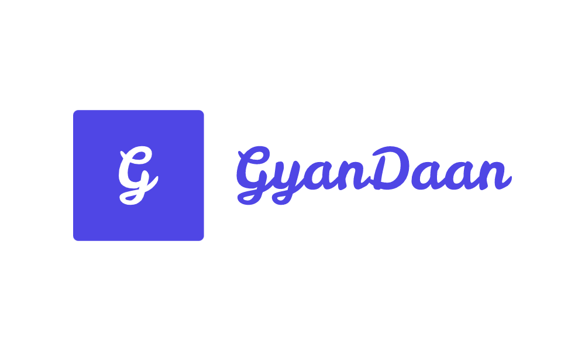

# GyanDaan
# Table of Contents
  * [About](#introduction)
  * [Logo](#logo)
  * [Demo](#demo)
  * [Design Pattern](#design-pattern)
  * [Tech stack](#tech-stack)
  * [Installation](#installation)
  * [Author](#author)

# About
### GyanDaan is a hub for community education. It is a web application that helps students and educators communicate with each other. It provides functionalities such as chat, channels, video conferencing, time analyzing which eases the communication. It is a platform where a group of people can learn together at the same time and no matter where they are. 


# Logo 


# Youtube Link
[Link](https://www.youtube.com/watch?v=9oHHZBZyGZE)

# Demo 
   [https://gyan-daan.herokuapp.com/](https://gyan-daan.herokuapp.com/)  
  
# Design pattern
  * Model-view-controller (MVC)
  * Repository pattern
  * Client-Server Architecture

# Tech stack
  
   * [MongoDB](https://www.mongodb.com/) - Database
   * [Express](https://expressjs.com/) - Server Framework
   * [NodeJS](https://nodejs.org/en/) - Server Environment
   * [Bootstrap](https://getbootstrap.com/) - CSS Framework
    
# Installation
  *  ## Local development environment
    
     1. [Clone this repository](https://help.github.com/en/articles/cloning-a-repository) with git.
          ``` 
          $ git clone https://github.com/daksh1223/Gyan-Daan
          ```
     2. Install dependencies by running ` npm install ` within the directory that you cloned (probably true-meet).
          ```  
          $ npm install 
          ``` 
     3. Set up the required environment variables using .env.example for reference.

     4. Start the development server with ` npm start ` .
          ```  
          $ npm start 
          ``` 
     5. Open development site by going to [http://localhost:3000](http://localhost:3000).
  
# Author

  [Daksh Sharma](https://github.com/daksh1223)  

  [Ayush Gupta](https://github.com/ayush3401)

  [Divya Sharma](https://github.com/divysharma007)
